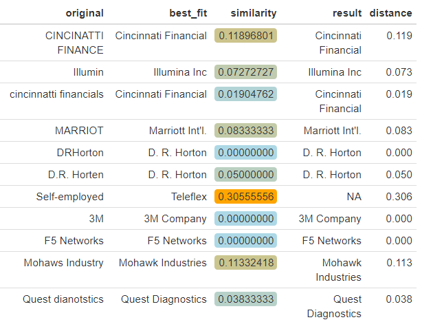

# LatinR

In this repository I uploaded the material I used at the LatinR Conference 2019 in Santiago de Chile. A lot more material - from the keynote speakers Hadley Wickham, Mine Çetinkaya-Rundel, Erin LeDell and many other great speakers can be found [here](https://github.com/LatinR/presentaciones-LatinR2019).

Fuzzy merging (or also called Fuzzy matching) is a way to map text that is written differently (e.g. Richard Vogg, RICHARD VOGG, Richard.vogg) to the same entity.

One approach is to have a list with "dirty" names and compare it to a list of "clean" names by creating a distance matrix with a suitable string distance metric (e.g. the Jaro-Winkler distance). 

In the code I later also tried to parallelize to improve the perfomance of the method and practice to work with the parallel package (it takes around 2 minutes for 500000 "dirty" names and 500 clean names) on 3 cores.

**Output:**

